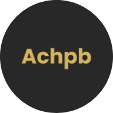
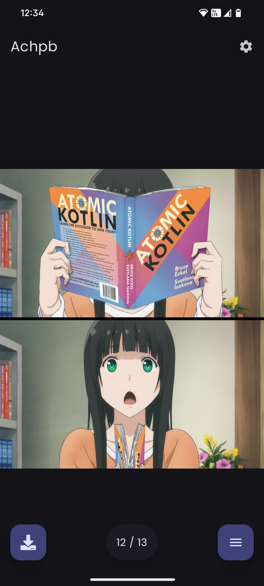
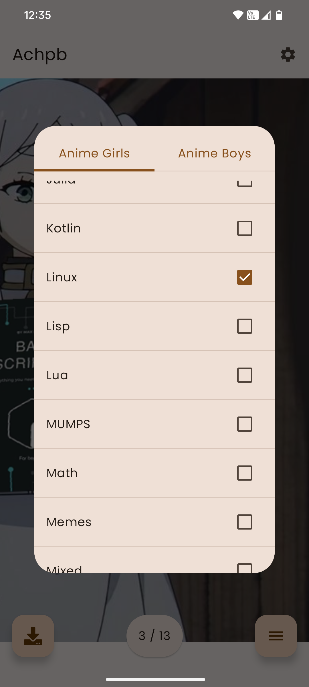

# Achpb

### Android client for [senpy](https://api.senpy.club/) which is an API for [Anime Girls Holding Programming Books](https://github.com/cat-milk/Anime-Girls-Holding-Programming-Books) and [Anime Boys Holding Programming Books](https://github.com/flyingcakes85/Anime-Boys-Holding-Programming-Books) because yes

> 
> 
> 

> ### Get From
> Dowload latest from [Releases](https://github.com/shub39/Achpb-client/releases)

### Screenshots 

|  |  |
|:-------------------------------------------------------------------------:|:-------------------------------------------------------------------------:|

### Libraries

> See [version catalog](gradle/libs.versions.toml) for more info

- Splashscreen for android
- Kotlinx Serialization Json
- Compose Navigation
- Network requests with Ktor
- Dependency Injection with Koin
- Saving settings with Datastore preferences
- [Zoomable](https://github.com/usuiat/Zoomable)
- [BuildKonfig](https://github.com/yshrsmz/BuildKonfig)
- [MaterialKolor](https://github.com/jordond/MaterialKolor) for theming
- [Landscapist](https://github.com/skydoves/landscapist) for images
- [Colorpicker Compose](https://github.com/skydoves/colorpicker-compose) for color picker
